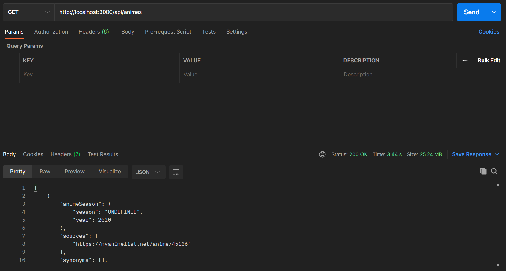
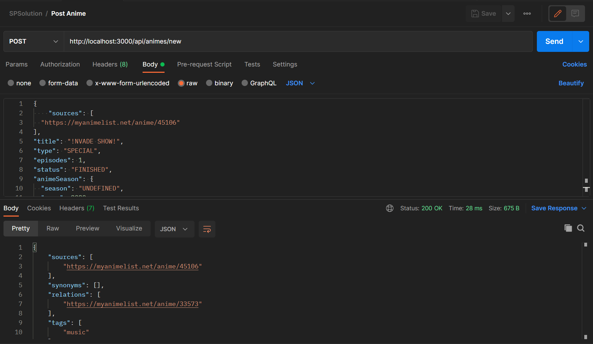
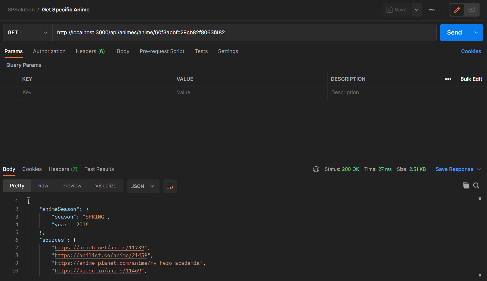
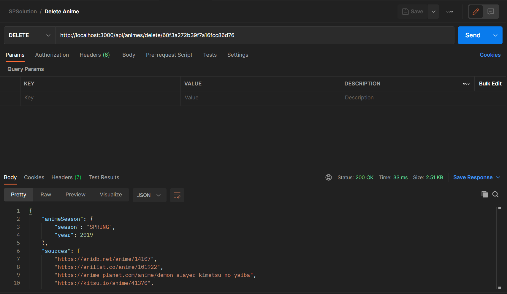
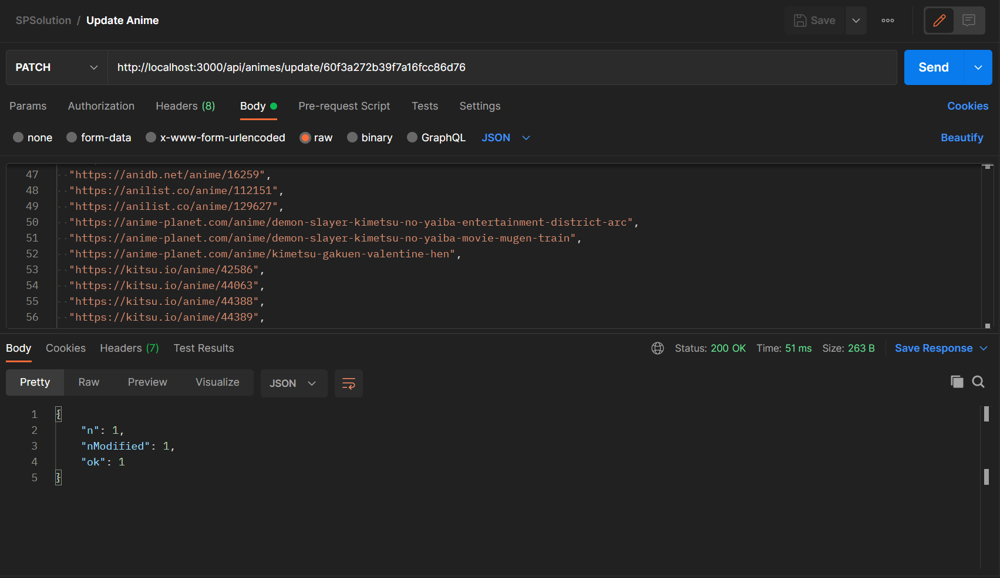
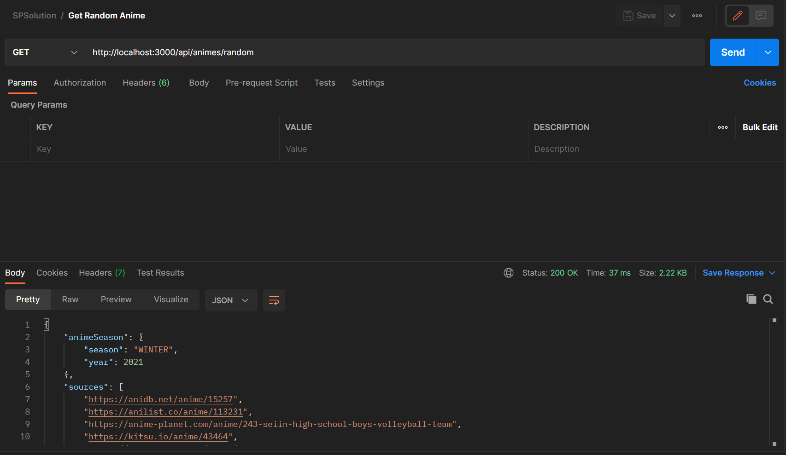
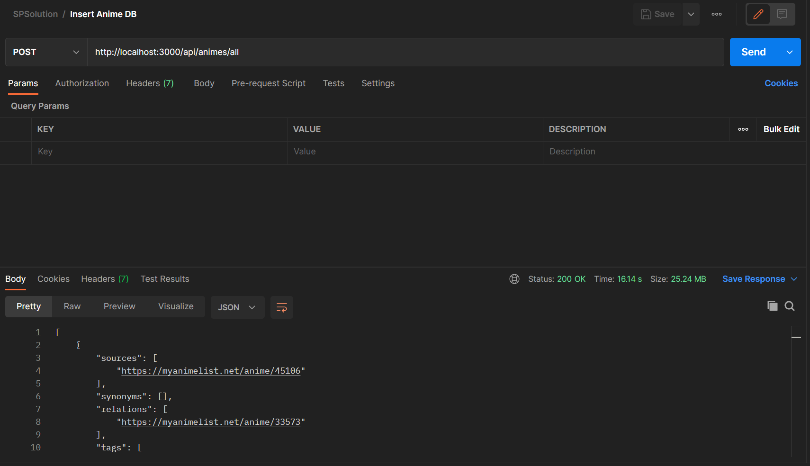

# Práctica Microservicios
_Práctica de Microservicios donde se interactúa con APIs, contenedores y microservicios._
----------------------------------------------------------------

## Aspectos Generales

### Requerimientos
* Contar con NodeJs instalado
* Contar con una base de datos en MongoDB

### Estructura del repositorio

Necesitamos algunos elementos para poder tener una REST API por lo que lo dividí en tres partes.
| N° | Name | Function |
| :---        |    :----:   |          :---: |
| 1 | Index | Crear una conexión entre todos los servicios para poder hacer uso de ellos. Además de inicializar el servidor y conectarse con la base de datos. |
| 2 | Routes | Función que nos ayudará a hacer las distintas peticiones usando el modelo para así solamente trabajar con este tipo de datos. |
| 3 | Models | Función que nos ayudará a definir el tipo de información que tendrán nuestros datos. Tendrá la información que tendrá cada colección de documentos. En este caso solo es una que tiene los diferentes datos solicitados en [Animes.js](./src/models/Anime.js). |

## Librerías de Funciones o Dependencias

Para iniciar se usaron los paquetes de *express*, *mongoose* y *morgan*.

* *Express* es un framework que nos proporciona un conjunto de funciones para aplicaciones web y móviles.

* *Mongoose* proporciona un modelo basado en esquemas para modelar los datos de la aplicación, para así poder modificar estos datos y poder hacer diferentes acciones como consultas, validaciones, entre otros.

* *Morgan* es un middleware para poder registrar solicitudes HTTP en Node Js.

## Pasos a seguir para utilizar la aplicación

Para poder usar la aplicación es necesario tener instalado Python (en caso de no tenerlo instalado se puede obtener del siguiente enlace https://www.python.org/downloads/ . Si se necesita más ayuda se recomienda acceder a tutoriales en YT). Pasos :

Para poder usar la es necesario tener instalado [NodeJs](https://nodejs.org/es/download/) (en caso de no tenerlo instalado dar click en el enlace. Si es necesario más ayuda consulta la documentación oficial).
También es necesario tener una base de datos en MongoDB para conectarla al [Index](./src/index) (_Cambiar la línea 12_).

Una vez que se cuente con los requerimientos podremos seguir los siguientes pasos:
1. Descargar y almacenar el archivo en su directorio de preferencia.
2. Acceder a la terminal, cambiar de directorio hacia el que tiene guardado nuestra carpeta Microservicios.
3. Usar el comando ``` npm install ``` para descargar las dependencias especificadas en el package.json.
4. Ejecutar el comando ``` npm run dev ``` para poder correr la práctica de manera local.
5. Probar los servicios del API.

## Pruebas

Se realizaron 7 servicios diferentes:
1. Obtener todos los animes en la colección.



2. Añadir un anime nuevo a la colección.



3. Obtener un anime específico a través de un id.



4. Eliminar un anime especifico a través de un id.



5. Actualizar un anime específico a través de un id y mandando los parámetros a actualizar.



6. Obtener un anime aleatorio de la colección.



7. Insertar varios documentos en la colección. En este caso se utilizó para poblar la base de datos.



## Referencias

* [NodeJs](https://nodejs.org/es/)

* [MongoDB](https://docs.mongodb.com/)

* [Mongoose](https://mongoosejs.com/docs/api.html)

* [Express](https://expressjs.com/es/)

* [AnimeDatabase](https://github.com/manami-project/anime-offline-database)