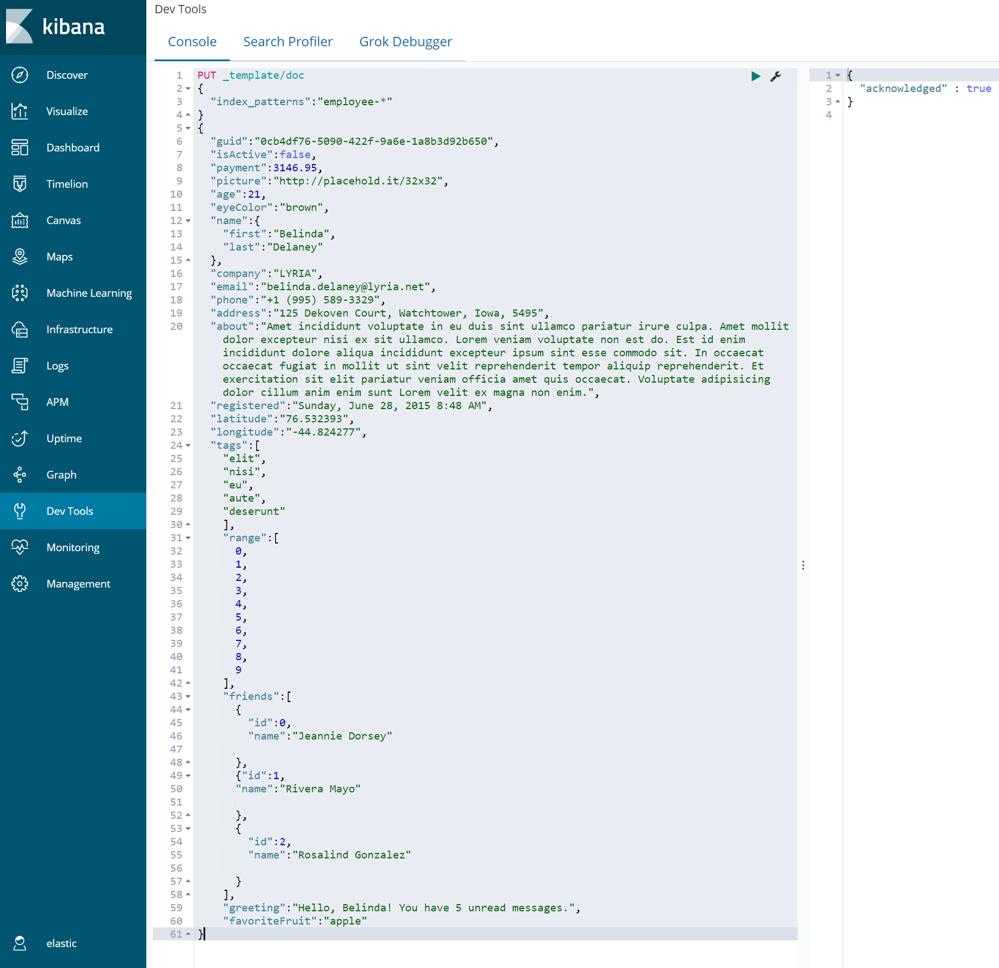
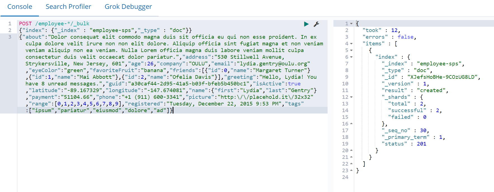

# SPS Práctica
_Práctica de S & P Solutions_
----------------------------------------------------------------

## ¿Qué es Elastic?
Elastic es un conjunto de motores los cuales ayudan a la análitica de datos. Esta compuesto de motores como [Kibana](https://www.elastic.co/es/what-is/kibana), [ElasticSearch](https://www.elastic.co/es/what-is/elasticsearch), [Beats](https://www.elastic.co/es/beats/) y [Logstash](https://www.elastic.co/es/logstash/)


### Kibana
Kibana es el frontend que se encarga de la visualización de datos y de búsqueda para los datos indexados en *ElasticSearch*.
Actúa como la interfaz de usaurio para monitorear y gestionar el cluster y concentrador centralizado de las soluciones intgradas.

### ElasticSearch
ElasticSearch es un motor de análitica y análisis distribuido para todo tipo de datos desde textuales, estructurado, no estructurados hasta datos geoespaciales. 
Se encarga principalmente del almacenamiento y el análisis de manera veloz y escalable.

### Beats
Beats es un motor para enviar datos operativos a *ElasticSearch*.
Manda datos de auditoría, logs, cloud data, datos de disponibilidad, metricas, entre otros.

### Logstash
Logstash es un pipeline el cual procesa datos y los transforma a los formatos, formas y tamaños deseados.
Su finalidad es parsear y transformar los datos sobre la marcha del proceso.


## Práctica ElascticSearch
Para está práctica se usó la versión *6.8.17* ya quela versión *6.6* no estaba disponible.


### 1. Definir el Template



Usando el siguiente comando en la consola de _Dev Tools_ podremos definir el template
```
PUT _template/doc
{
  "index_patterns":"employee-*"
}
{
  "guid":"0cb4df76-5090-422f-9a6e-1a8b3d92b650",
  "isActive":false,
  "payment":3146.95,
  "picture":"http://placehold.it/32x32",
  "age":21,
  "eyeColor":"brown",
  "name":{
    "first":"Belinda",
    "last":"Delaney"
  },
  "company":"LYRIA",
  "email":"belinda.delaney@lyria.net",
  "phone":"+1 (995) 589-3329",
  "address":"125 Dekoven Court, Watchtower, Iowa, 5495",
  "about":"Amet incididunt voluptate in eu duis sint ullamco pariatur irure culpa. Amet mollit dolor excepteur nisi ex sit ullamco. Lorem veniam voluptate non est do. Est id enim incididunt dolore aliqua incididunt excepteur ipsum sint esse commodo sit. In occaecat occaecat fugiat in mollit ut sint velit reprehenderit tempor aliquip reprehenderit. Et exercitation sit elit pariatur veniam officia amet quis occaecat. Voluptate adipisicing dolor cillum anim enim sunt Lorem velit ex magna non enim.",
  "registered":"Sunday, June 28, 2015 8:48 AM",
  "latitude":"76.532393",
  "longitude":"-44.824277",
  "tags":[
    "elit",
    "nisi",
    "eu",
    "aute",
    "deserunt"
    ],
    "range":[
      0,
      1,
      2,
      3,
      4,
      5,
      6,
      7,
      8,
      9
    ],
    "friends":[
      {
        "id":0,
        "name":"Jeannie Dorsey"
        
      },
      {"id":1,
      "name":"Rivera Mayo"
        
      },
      {
        "id":2,
        "name":"Rosalind Gonzalez"
        
      }
    ],
    "greeting":"Hello, Belinda! You have 5 unread messages.",
    "favoriteFruit":"apple"
}
```
Ahora cargaremos una serie de documentos en el índice. Puedes visualizar estos documentos en el archivo [Employee.json](./Resources/Employee.json).
Ejecuta el siguiente comando en la consola de _Dev Tools_ para cargar estos documentos.



_Este codigo solo es un ejemplo._ Se deberá poner todos los documentos a cargar.

```
POST /employee-*/_bulk
{"index": {"_index" : "employee-sps","_type" : "doc"}}
{"about":"Dolor consequat elit commodo magna duis sit officia eu qui non esse proident. In ex culpa dolore velit irure non non elit dolore. Aliquip officia sint fugiat magna et non veniam veniam aliquip non ea veniam. Nulla Lorem officia magna duis labore veniam mollit culpa consectetur duis velit occaecat dolor pariatur.","address":"530 Stillwell Avenue, Strykersville, New Jersey, 601","age":26,"company":"OULU","email":"lydia.gentry@oulu.org","eyeColor":"green","favoriteFruit":"banana","friends":[{"id":0,"name":"Margaret Turner"},{"id":1,"name":"Mai Abbott"},{"id":2,"name":"Ofelia Davis"}],"greeting":"Hello, Lydia! You have 8 unread messages.","guid":"a30caf44-2d95-41a5-b03f-bfeb5b450bc1","isActive":true,"latitude":"-89.167329","longitude":"-147.674081","name":{"first":"Lydia","last":"Gentry"},"payment":"51104.66","phone":"+1 (911) 600-3341","picture":"http:\/\/placehold.it\/32x32","range":[0,1,2,3,4,5,6,7,8,9],"registered":"Tuesday, December 22, 2015 9:53 PM","tags":["ipsum","pariatur","eiusmod","dolore","ad"]}
```

### 2. Búsquedas sobre el Índice

#### * *Busca todos los empleados que superem los 30 años.*


#### * *Busca el top 5 empleados menores o iguales a 30 años que tienen sueldo mayor a los 50 mil pesos.*

## Práctica de Microservicios
La documentación la puedes encontrar en [MICROSERVICIOS.md](./Microservicios/MICROSERVICIOS.md)

## Referencias
[ElasticSearchGuide](https://www.elastic.co/guide/en/elasticsearch/reference/current/index.html)